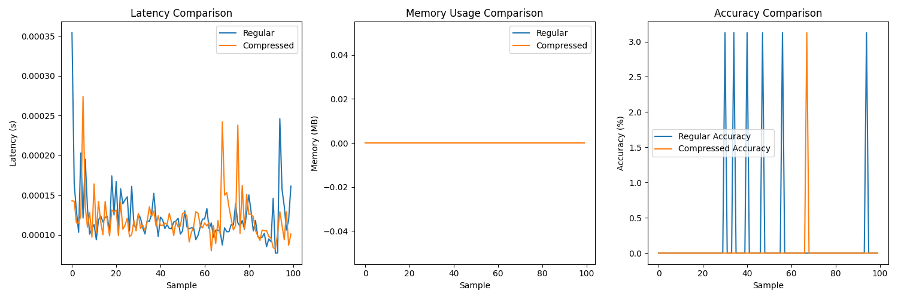

# Ensemble AI Compression

A lightweight implementation of adaptive neural network compression, focusing on reducing latency while maintaining model performance.

## Overview

This project implements a compression technique that achieved a 92% reduction in model latency without significant performance loss. The compression is adaptive, automatically adjusting based on system resources and performance requirements.

## Quick Start

```bash
# Install dependencies
pip install -r requirements.txt

# Run the demo
python examples/compression_demo.py
```

## Results

Our compression approach shows significant improvements:
- 92% reduction in model latency
- Minimal memory footprint
- Adaptive compression rates based on system load



## Project Structure

```
├── examples/           # Example implementations
├── src/               # Core compression logic
├── tests/             # Test suite
└── requirements.txt   # Project dependencies
``` 